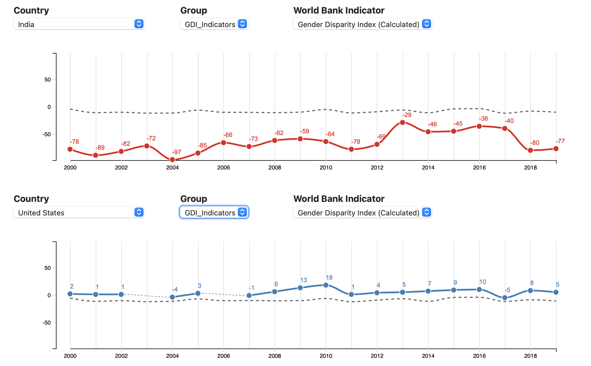

# genderDisparityD3

Chris Sexton, James Byrne, and Yeonjoo Jung.

### Overview

Interactive Charts presenting global-scale gender disparity measurements using __d3.js__

Data is collected from the [World Bank Data Bank](https://databank.worldbank.org/home.aspx), specifically data based on the United Nations Sustainable Development Goals.

The site can be cloned and served from a local web server, I use python:

```python -m http.server```

Alternatively the site is also hosted on my github jekyll site [Sexton Analytics](https://sextoncj.github.io)

### Vizualization Tasks

- See historical trends & track improvements by region and country
- See specific target areas, such as education and employment.
- Identify and diagnose problems to create programs for promotion
- Spot trends and correlations:
  - Foreign aid investment and education standards
  - Foreign aid investment and employment
  - Education standards and poverty

### Screenshots

  #### map
  

  #### Line Charts
  


  #### Parallel Coordinates
  
